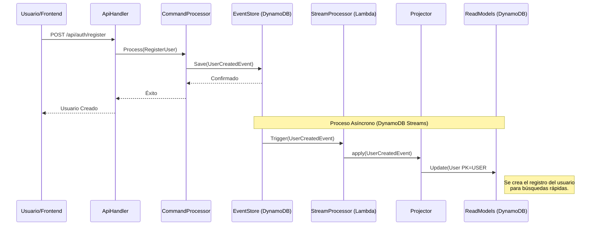
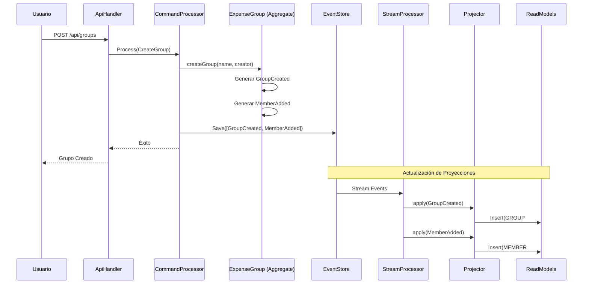
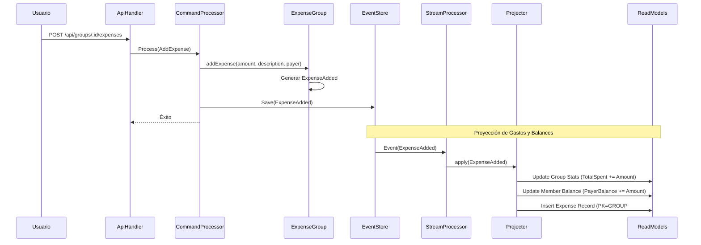
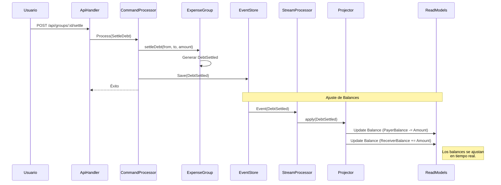

# Documentación de Flujos del Backend

Este documento detalla la arquitectura de Event Sourcing y cómo se procesan los comandos principales del sistema, incluyendo la actualización de las proyecciones (Read Models).

## Arquitectura General
El sistema utiliza un patrón **CQRS (Command Query Responsibility Segregation)** con **Event Sourcing**:
1.  **Comandos**: Acciones del usuario que intentan cambiar el estado.
2.  **Event Store**: Almacenamiento inmutable de todos los eventos del dominio.
3.  **Proyecciones**: Modelos de lectura optimizados que se actualizan de forma asíncrona reaccionando a los eventos.

---

## 1. Creación de Usuario
Cuando un nuevo usuario se registra.

---

## 2. Creación de Grupo
Involucra la creación del grupo y la adición automática del creador como primer miembro.

---

## 3. Agregar Gasto
El flujo crítico donde se actualizan los balances.

---

## 4. Liquidación de Cuentas
Cuando un miembro paga lo que debe a otro para saldar la deuda.

---

## Lógica de Actualización de Proyecciones
El `StreamProcessor` se activa cada vez que DynamoDB detecta una nueva entrada en la tabla `event_store`. 

1.  **Captura**: La Lambda recibe el `INSERT` del evento.
2.  **Identificación**: Se identifica el tipo de evento (`GROUP_CREATED`, `EXPENSE_ADDED`, etc.).
3.  **Acción**: El `Projector` ejecuta la lógica correspondiente en la tabla `read_models`. 
    -   Utiliza operaciones atómicas como `ADD` para los balances para evitar condiciones de carrera.
    -   Permite que las vistas del frontend (como el Dashboard o los detalles del grupo) carguen datos pre-calculados al instante sin tener que recorrer todo el historial de eventos.
